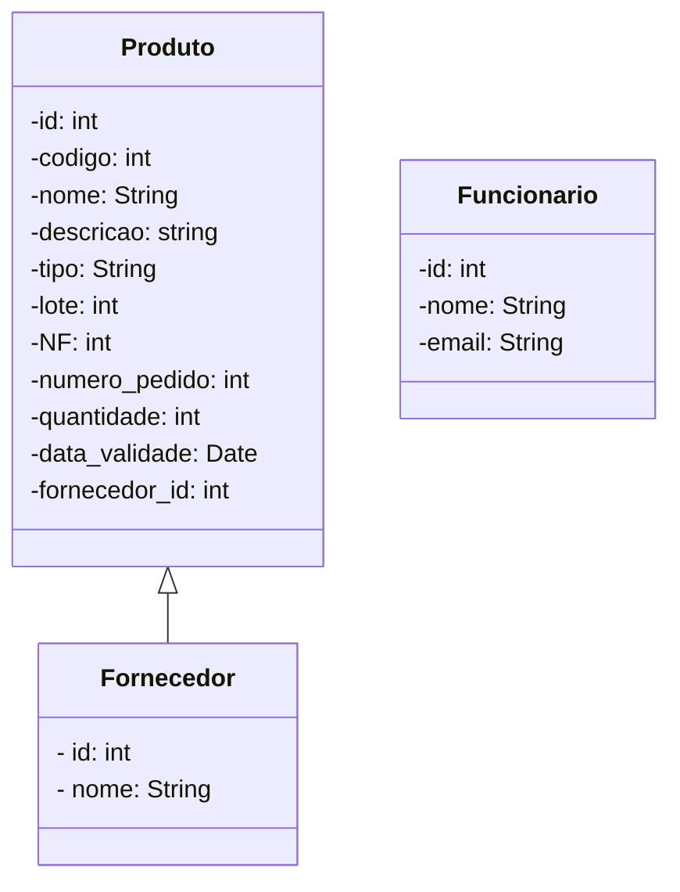

# Sistema Agricula

## Esquema

```mermaid
classDiagram

    Produto <|-- Fornecedor

    class Produto {
        -id: int
        -codigo: int
        -nome: String
        -descricao: string
        -tipo: String
        -lote: int
        -NF: int
        -numero_pedido: int
        -quantidade: int
        -data_validade: Date
        -fornecedor_id: int
    }

    class Fornecedor {
        - id: int
        - nome: String
    }
    
    class Funcionario {
      -id: int 
      -nome: String 
      -email: String  
    }

```

## Setup

Instalar dependencias
```bash
npm i
```
Rodar servidor de desenvolvimento
```bash
npm run dev
```
Build para produção
```bash
npm run build
```
